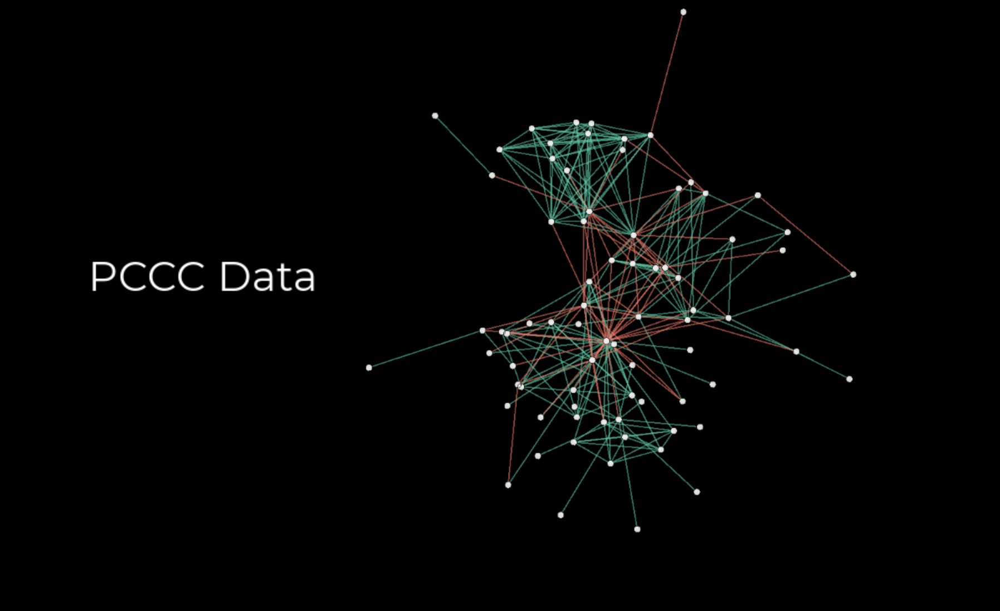

<h1 align="center">
  <br>
  
  

</h1>

Data and constraint sets for clustering with hard and soft must-link and cannot-link constraints. A detailed description of the data can be found in https://arxiv.org/abs/2212.14437.

## Dependencies

PCCC depends on:
* pandas==1.4.4
* numpy==1.23.3
* scikit-learn==0.24.2
* requests==2.28.1
* gdown==4.4.0
* idx2numpy==1.2.3

## Installation

1) Clone this repository
3) Install the required packages

## Usage

Run main.py which downloads raw data and processes/generates data sets and constraint sets 

## Reference

Please cite the following paper if you use this code.

**Baumann, P. and Hochbaum D. S.** (2023): PCCC: The Pairwise-Confidence-Constraints-Clustering Algorithm. https://arxiv.org/abs/2212.14437

Bibtex:
```
@article{baumann2023pccc,
	author={Baumann, Philipp and Hochbaum, Dorit S.},
	booktitle={},
	title = {PCCC: the pairwise-confidence-constraints-clustering algorithm},
	year={2023},
	url = {https://arxiv.org/abs/2212.14437},
	doi = {10.48550/ARXIV.2212.14437},
}
```

## License

This project is licensed under the MIT License - see the [LICENSE](LICENSE) file for details


